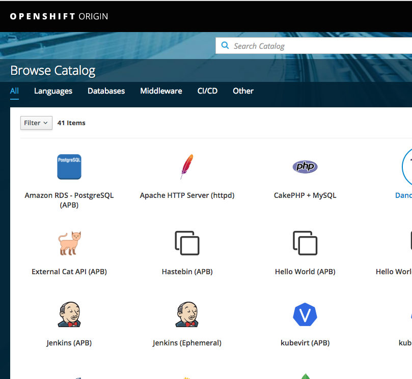
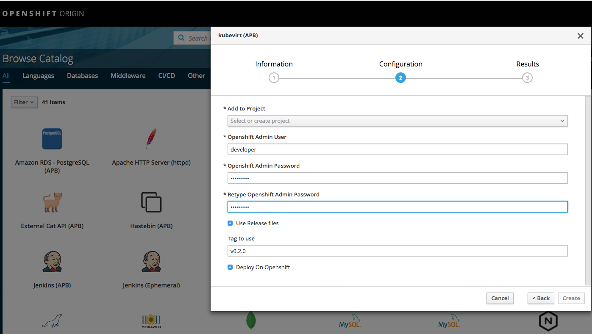

# KubeVirt-apb
This *Ansible Playbook Bundle* deploys [Kubevirt](http://www.kubevirt.io)

As the resources deployed need cluster-admin privileges, credentials of a
super user are required for the APB to execute correctly.

## Build the APB

The apb-tool is required to prepare render the Dockerfile.
```bash
pip install apb
```

Build the APB.
```bash
make kubevirt-apb
```

## Variables
| Variable        | Default Value           | Description  |
|:------------- |:-------------|:----- |
| tag | sprint5 | Tag to use for KubeVirt related images |
| admin_user | admin | User with cluster-admin permission |
| admin_password | admin | Password for cluster-admin user |
| release | True |  Whether to download the templates used from KubeVirt github releases or render them from local templates |


## Deploy with the CLI

1) Edit ```templates/kubevirt-apb.yml``` and set ```admin_user``` and ```admin_password``` credentials that have cluster-admin permission.

2) Deploy from command line:

```
kubectl create -f templates/kubevirt-apb.yml
```

## Deploy from the UI





